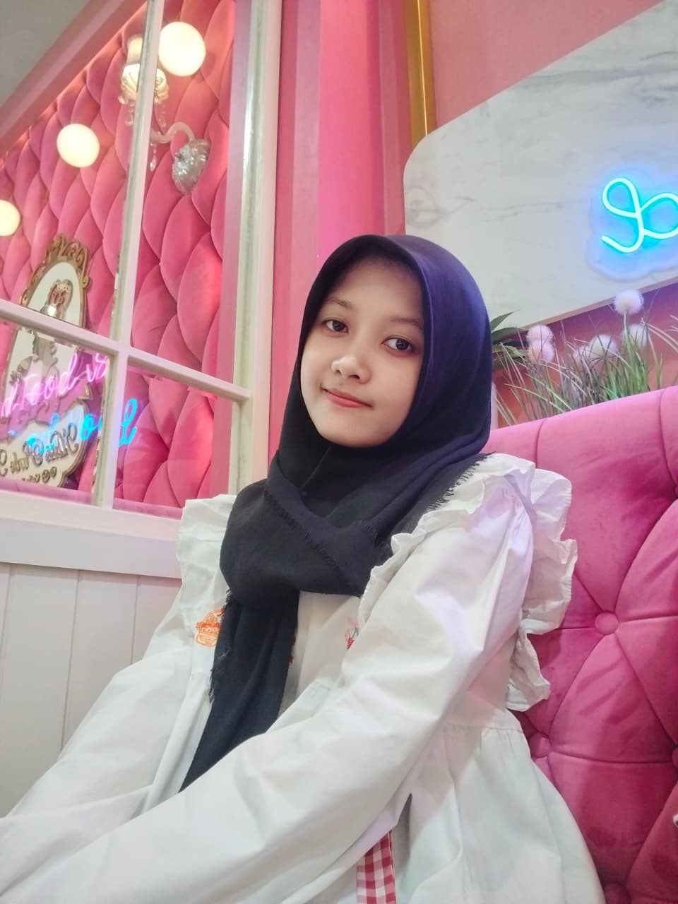
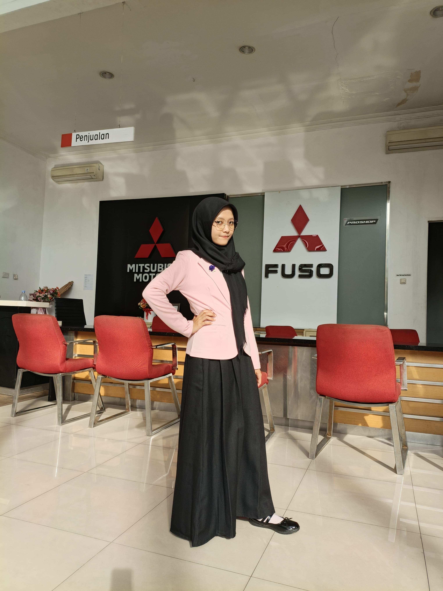
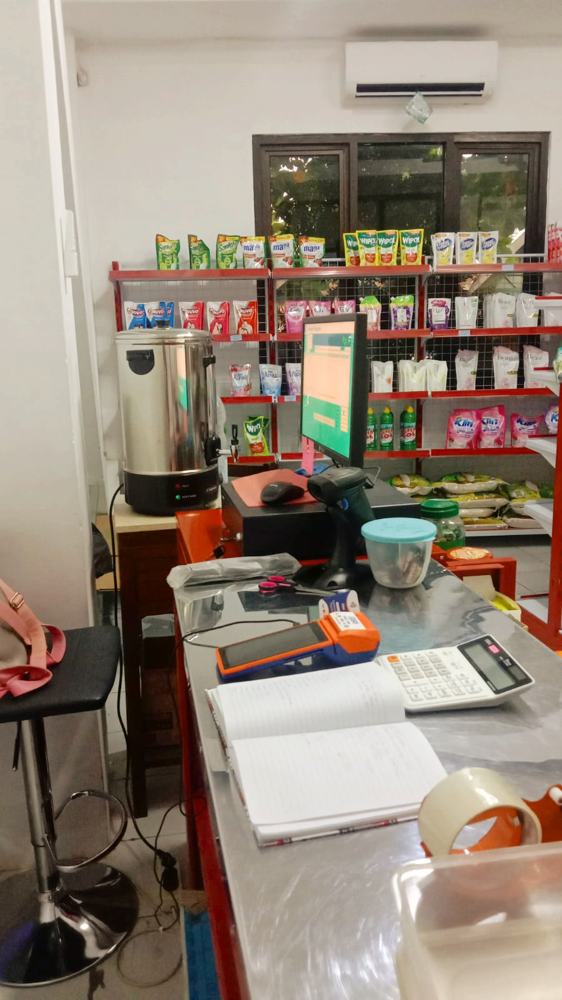
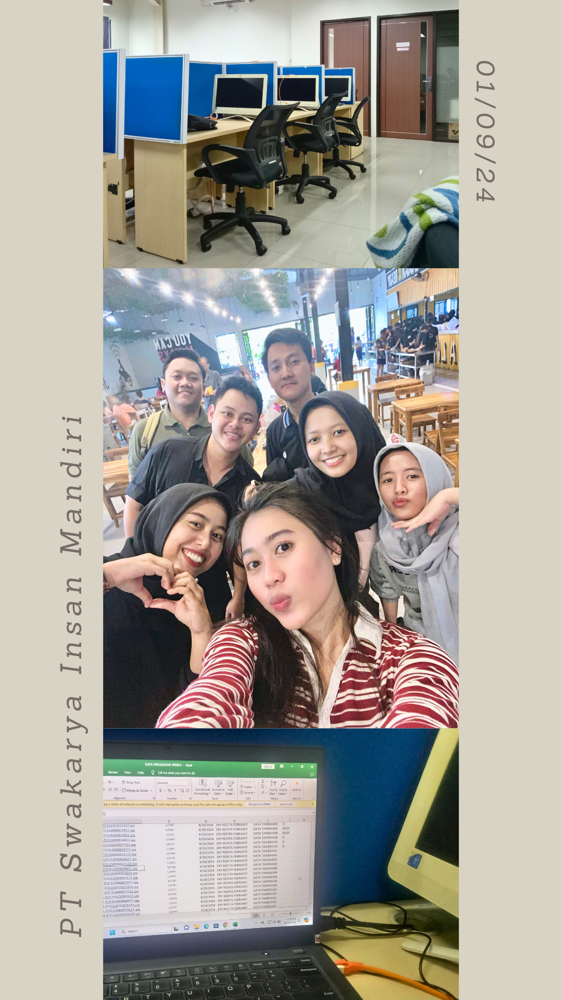
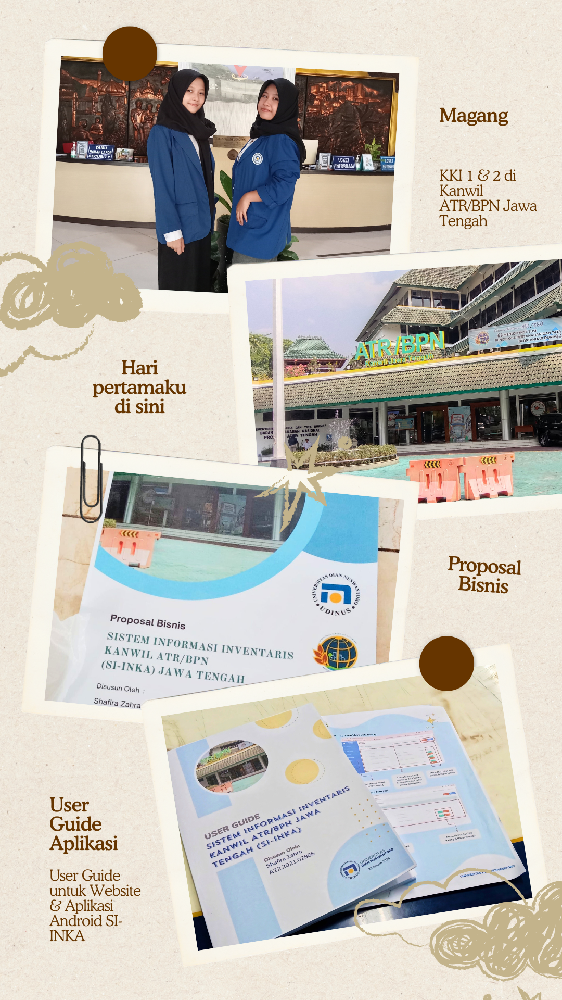
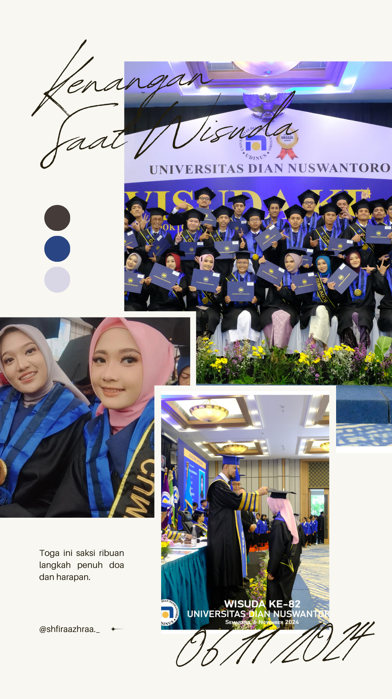
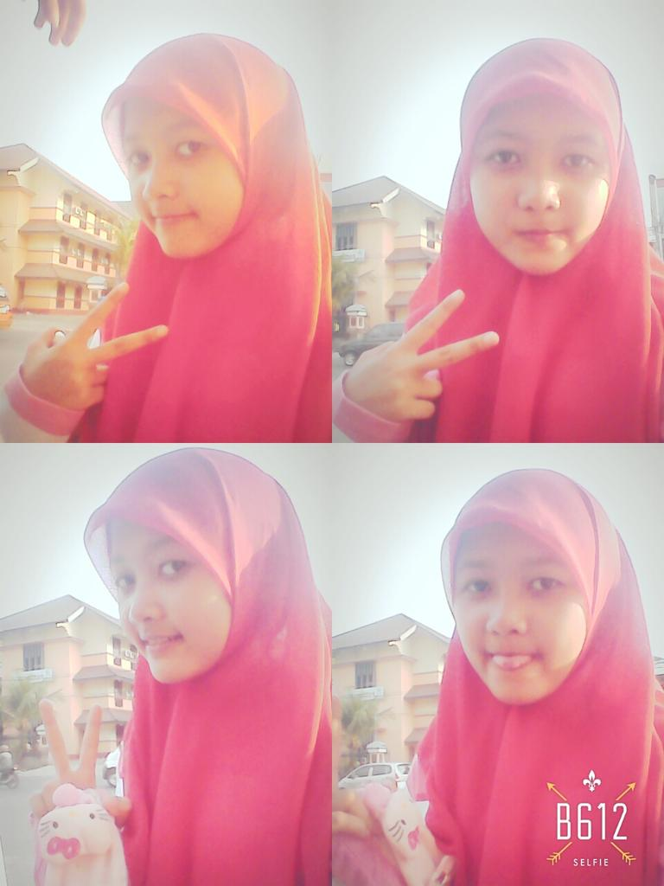

<!DOCTYPE html>
<html lang="id">
<head>
    <meta charset="UTF-8">
    <meta name="viewport" content="width=device-width, initial-scale=1.0">
    <title>Shafira Zahra</title>
    
    <link rel="icon" type="image/png" href="icon.png">
    <link href="https://fonts.googleapis.com/css2?family=Poppins:wght@300;400;600&family=Playfair+Display:wght@600;700&display=swap" rel="stylesheet">
    <link href="https://unpkg.com/aos@2.3.1/dist/aos.css" rel="stylesheet">
     <link rel="stylesheet" href="style.css">
</head>
<body class="no-scroll">

    

        

            
Open Me

            

                
❤

                

                    
                    
Welcome to my Portfolio ✨

                

            

        

    

    

    <nav>
        

            

        

     
ShafiraZahra

        

        
        

        <button id="backToLobby" class="nav-btn" style="display: none; margin-right: 10px;" onclick="showLobby()">🏠 Lobby</button>
        <button id="darkModeToggle" class="nav-btn">🌙</button>
        <button id="langToggle" class="nav-btn">EN</button>
    

    </nav>

    

       <ul>
    <li><a href="javascript:void(0)" onclick="showLobby(); toggleMenu();">🏠 Home / Lobby</a></li>
    
    <li><a href="javascript:void(0)" onclick="navigateFromSidebar('pro', 'skills')">🛠 Technical Skills</a></li>
    <li><a href="javascript:void(0)" onclick="navigateFromSidebar('pro', 'projects')">💻 IT Projects</a></li>
    <li><a href="javascript:void(0)" onclick="navigateFromSidebar('pro', 'certificates')">📜 IT Certifications</a></li>
    
    <li><a href="javascript:void(0)" onclick="navigateFromSidebar('creative', 'projects')">🎨 Art & Sewing</a></li>
    
    <li><a href="javascript:void(0)" onclick="navigateFromSidebar('personal', 'journey')">🌸 My Story</a></li>
    
    <li><a href="#contact" onclick="toggleMenu()">📧 Contact</a></li>
</ul>
    

   <header class="hero" id="home">
    
    <h1 data-aos="fade-up">Halo, Aku Shafira Zahra ✨</h1>
    

        <b id="hero-desc">Seorang Multidisiplin Lulusan D3 Teknik Informatika UDINUS yang menghubungkan ketelitian Administrasi Servis dengan inovasi Front-End Development. Saya memadukan logika sistem, disiplin operasional, dan estetika visual untuk menciptakan solusi digital yang presisi dan intuitif.</b>
    

    

        <a href="https://drive.google.com/drive/folders/1bfBt_30iKEXvEBnYyIn_5i6eOZMQtu5a?usp=drive_link" download class="btn-download" id="CVText">
            📄 Download CV
        </a>
        

    

        
💼

        <h3 id="ProTitle">Professional Path</h3>
        
IT & Admin Portfolio

    

    

        
🎨

        <h3 id="CreTitle">Creative Hub</h3>
        
Art & Sewing Works

    

    

        
📖

        <h3 id="PerTitle">The Story</h3>
        
My Life & Journey

    

    

</header>

    <section id="skills" class="section">
        <h2 class="section-title" data-aos="fade-down">Technical Skills</h2>
    

    

        

            Computational Logic & Problem Solving
            Advanced
        

        
⭐⭐⭐⭐⭐

    

    

        

            Ethical Compliance & Data Integrity
            Advanced
        

        
⭐⭐⭐⭐⭐

    

        

        

            Human-Centric Interaction (UI/UX)
            Advanced
        

        
⭐⭐⭐⭐⭐

    

         

        

            Scientific Data Analysis
            Intermediate
        

        
⭐⭐⭐⭐

    

 

        

            Database & Information Management
            Intermediate
        

        
⭐⭐⭐⭐

    

           

        

            System Architecture & SDLC
            Intermediate
        

        
⭐⭐⭐⭐

           

        
 

        

            Communication
            Intermediate
        

        
⭐⭐⭐⭐

    

    

    </section>

    <section id="journey" class="section" style="background-color: var(--pink-bg);">
        <h2 class="section-title" data-aos="fade-down">My Journey</h2>
        
(Klik nama tempat untuk detail dokumentasi ✨)

        

            

                2025-2026
                <h3 id="BRATitle">PT Bumen Redja Abadi</h3>
                
Warranty Service Claim Administrator

                

                    
                    
• Menginput data klaim (informasi kendaraan, jenis kendaraan, part yang diganti ke dalam sistem.

                    
• Mengelola dan mengarsipkan semua dokumen klaim garansi (faktur, job order, formulir klaim, foto kerusakan, dll) baik secara fisik maupun digital.

                    
• Memastikan kelengkapan dan keakuratan data klaim sebagai bukti.

                    
• Berkoordinasi dengan bagian bengkel/teknisi terkait teknis perbaikan dan penggantian part garansi.

                    
• Membuat laporan mengenai jumlah klaim, status klaim yang di tolak, atau masih dalam proses.

                

            

            

                2024-2025
                <h3 id="BPNTitle">Kantor Wilayah ATR/BPN Provinsi Jawa Tengah</h3>
                
Karyawan Koperasi

                

                    
                    
• Mengelola dan memelihara akurasi data inventaris stok kebutuhan kantor, mengurangi potensi stockout hingga 15%.

                    
• Menerapkan alur kerja (workflow) terstruktur untuk prosedur permintaan dan distribusi barang, menjamin efisiensi operasional.

                    
• Bertanggung jawab atas integritas dan kepatuhan data, serta mengkoordinasikan respons terhadap permintaan data mendesak antar unit kerja.

                    
• Berkolaborasi dengan stakeholder internal untuk memastikan kelancaran operasional dan kebutuhan unit kerja terpenuhi.

                

            

            

                2024-2024
                <h3 id="SIMTitle">PT Swakarya Insan Mandiri</h3>
                
Data Entry

                

                    
                    
• Secara konsisten menginput dan memproses 840 data Kartu Keluarga (KK) untuk mitra FIF.

                    
• Mempertahankan tingkat akurasi data 99% melalui verifikasi silang data, secara efektif mengurangi error rate dalam basis data operasional.

                    
• Mengoperasikan sistem input data proprietary dan memanfaatkan Microsoft Excel untuk manajemen dan pelaporan data.

                    
• Melakukan pembersihan data (data cleaning) dan validasi data secara teratur untuk memastikan konsistensi dan integritas data historis.

                

            

            

                2023-2024
                <h3 id="KanwilTitle">Kantor Wilayah ATR/BPN Provinsi Jawa Tengah</h3>
                
Data Engineer | Data Center

                

                    
                    
• Secara rutin menerapkan pembaruan sistem operasi (patching), firmware, dan upgrade perangkat lunak untuk menjaga keamanan dan kinerja.

                    
• Melakukan perencanaan kapasitas (capacity planning) untuk memastikan sumber daya server dan storage cukup.

                    
• Melakukan audit berkala terhadap perangkat keras dan perangkat lunak untuk memastikan kepatuhan dan mendeteksi kerentanan.

                    
• Mendiagnosis dan menyelesaikan masalah kompleks yang berkaitan dengan server, sistem operasi, aplikasi, atau koneksi ke penyimpanan data (storage).

                    
• Memberikan dukungan teknis kepada tim lain (misalnya developer atau end-user) terkait akses dan masalah pada sistem server.

                

            

            

                2022-2022
                <h3 id="IdolaTitle">Milkshake Idola & Seblak Seuhah</h3>
                
F&B Stand Operator

                

                    
                    
• Mengelola dan merekapitulasi seluruh transaksi penjualan harian dan memastikan akurasi dan perhitungan dan keseimbangan kas akhir hari.

                    
• Mencatat data penjualan dan permintaan pelanggan untuk dianalisis sebagai masukan peningkatan stok dan menu.

                    
• Berinteraksi langsung dengan pelanggan untuk memahami kebutuhan mengelola keluhan, dan memastikan kepuasan layanan.

                    
• Bertanggung jawab atas stock management dan kerapian operasional untuk memastikan kualitas layanan yang tinggi.

                

            

            

                2021-2024
                <h3 id="UDINUSTitle">Universitas Dian Nuswantoro</h3>
                
D3 Teknik Informatika | IPK 3,51

                

                    
                    
• Menjadi Panitia Workshop HMDTI Tahun 2023.

                    
• Mengikuti UKM Catur.

                    
• Menjadi Anggota dan ikut serta aktif dalam kegiatan HMDTI.

                

            

            

                2020-2020
                <h3 id="BBPLKTitle">BBPLK Semarang</h3>
                
Pelatihan Kerja Menjahit Pakaian Pria | A

                

                    
                    
• Menjahit dengan Alat Jahit Tangan

                    
• Menjahit dengan Mesin.

                    
• Mengikuti Prosedur Keselamatan & Kesehatan di Tempat Kerja (K3).

                

            

            

                2017-2020
                <h3 id="SMA10Title">SMA N 10 Semarang</h3>
                
Jurusan MIPA | 82,60

                

                    
                    
• Mengikuti Ekstakulikuler Palang Merah Remaja

                    
• Mengikuti Ekstrakulikuler Olimpiade Kimia

                    
• Mengikuti Lomba di Sakura No Matsuri Hino Tahun 2017, lomba OSN Ekonomi, lomba Mural Art.

                

            

            

                2014-2017
                <h3 id="SMP6Title">SMP N 6 Semarang</h3>
                
84,00

                

                    
                    
• Mengikuti Ekstakulikuler Karya Ilmiah Remaja

                    
• Mengikuti Ekstrakulikuler Catur

                    
• Mengikuti Lomba Menulis Cerpen.

                

            

        

    </section>

    <section id="projects" class="section">
        <h2 class="section-title" data-aos="fade-down">Featured Projects</h2>
        

             <a href="http://tokosejatikosmetik.42web.io/" target="_blank" data-aos="fade-up">
                

                    <h3 id="SejatiTitle">Toko Sejati Cosmetics</h3>
                    
Website untuk E-Commerce Toko Sejati Cosmetics

                    
Tech Stack: Code Igniter 3, PHP, CSS, HTML, MYSQL

                

            </a>
            <a href="https://bra-servicewarehouse.web.app/index.html" target="_blank" data-aos="fade-up" data-aos-delay="100">
                

                    <h3 id="BRATitlePro">BRA-WAREHOUSE SERVICE</h3>
                    
Sistem Pencatatan detail kendaraan mulai dari Nomor WO, Plat Nomor, hingga Tipe Kendaraan dan Nama Customer secara terstruktur

                     
Tech Stack: Firebase,Javascript, CSS, HTML

                

            </a>
            <a href="https://appinventorykanwilbpn.42web.io/?i=1" target="_blank" data-aos="fade-up" data-aos-delay="200">
                

                    <h3 id="INKATitle">SI-INKA</h3>
                    
Sistem Inventaris Barang Kanwil ATR/BPN berbasis Website & Mobile

                     
Tech Stack: Code Igniter 3, PHP, CSS, HTML, MYSQL

                

            </a>
            <a href="https://petapersebarankotajambi.42web.io/?i=1" target="_blank" data-aos="fade-up" data-aos-delay="300">
                

                    <h3 id="GISTitle">PETA PERSEBARAN WILAYAH JAMBI DALAM BENTUK WEB GIS</h3>
                    
Sistem Informasi Geografis Persebaran Rumah Sakit Pada Wilayah Kota Jambi Tahun 2016

                     
Tech Stack: Code Igniter 3, PHP, CSS, HTML, MYSQL, QGIS

                

            </a>
            <a href="https://lyferaa.github.io/Lyfera/" target="_blank" data-aos="fade-up" data-aos-delay="400">
                

                    <h3 id="LyferaTitle">Lyfera's Art</h3>
                    
Kumpulan berbagai karya seni ku dalam bentuk website yang interaktif

                     
Tech Stack: Javascript, CSS, HTML

                

            </a>
        

    </section>

    <section id="certificates" class="section" style="background-color: var(--pink-bg);">
        <h2 class="section-title" data-aos="zoom-in">Certifications</h2>
        

            <table class="cert-table">
                <thead>
                    <tr><th>No</th><th>Nama Sertifikat </th><th>Penyelenggara</th></tr>
                </thead>
             <tbody>
    <tr class="type-pro">
        <td>1</td><td>Sertifikat Kompetensi Keahlian Pemrograman Web</td><td>APTI</td>
    </tr>
    <tr class="type-pro">
        <td>2</td><td>Sertifikat Kompetensi Pemrograman Mobil Pratama</td><td>BNSP</td>
    </tr>
    <tr class="type-pro">
        <td>3</td><td>TOEFL PREPARATION</td><td>UDINUS</td>
    </tr>
    <tr class="type-pro">
        <td>4</td><td>Sertifikat Seminar Nasional Teknik Informatika</td><td>UDINUS</td>
    </tr>

    <tr class="type-creative">
        <td>1</td><td>Sertifikat Kompetensi Menjahit Pakaian</td><td>Kemenaker RI</td>
    </tr>
    <tr class="type-creative">
        <td>2</td><td>Sertifikat Kompetensi Menjahit Pakaian</td><td>BNSP</td>
    </tr>
    <tr class="type-personal">
        <td>1</td><td>Sertifikat Finalis 8 Besar Business Plan</td><td>UPGRIS</td>
    </tr>
     <tr class="type-creative">
        <td>3</td><td>Sertifikat Lomba Mural Art</td><td>UDINUS</td>
    </tr>
</tbody>
            </table>
        

    </section>
        
    <footer id="contact">
        <h2 data-aos="fade-up">Get In Touch</h2>
        

            <a href="https://www.linkedin.com/in/shfiraazhraa/" target="_blank">LinkedIn</a>
            <a href="https://instagram.com/shfiraazhraa._" target="_blank">Instagram</a>
           <a href="https://wa.me/628973179630" target="_blank">WhatsApp</a>
        

        
&copy; 2026 Shafira Zahra ✨ Built with Passion

    </footer>

</body>
</html> 
